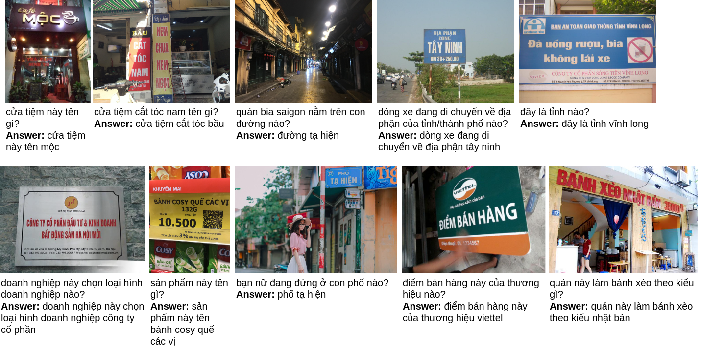

OpenViVQA: Open-domain Vietnamese Visual Question Answering
=====

Examples of some samples of the OpenViVQA dataset and the results of some experiments. Note that texts in green indicate scene texts copied from the images.

The dataset will be available when our paper will have been accepted.

### Contact

This repository was constructed under the instruction of the [NLP@UIT](https://nlp.uit.edu.vn/). For more information, contact the following authors:
1. Nghia Hieu Nguyen. Email: 19520178@gm.uit.edu.vn
2. Duong T.D Vo. Email: 19520483@gm.uit.edu.vn
